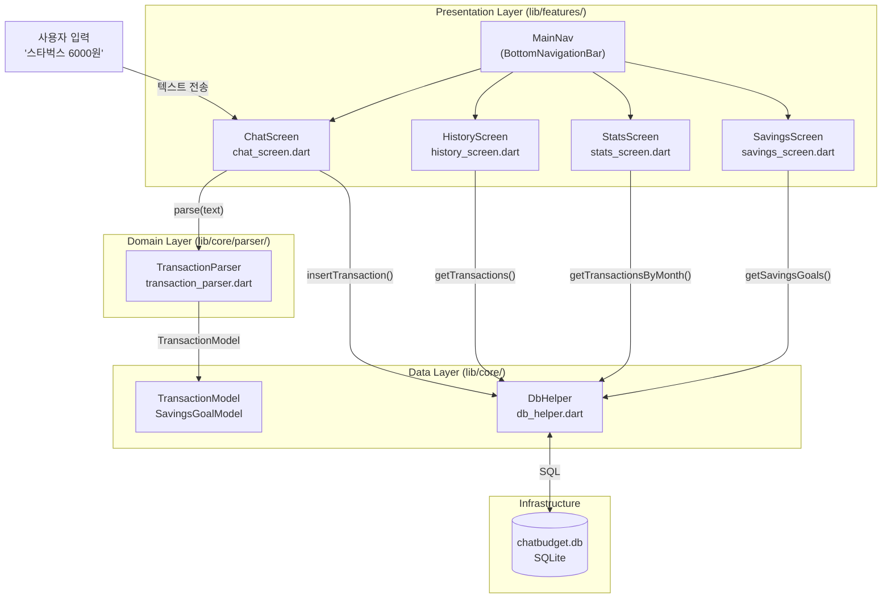
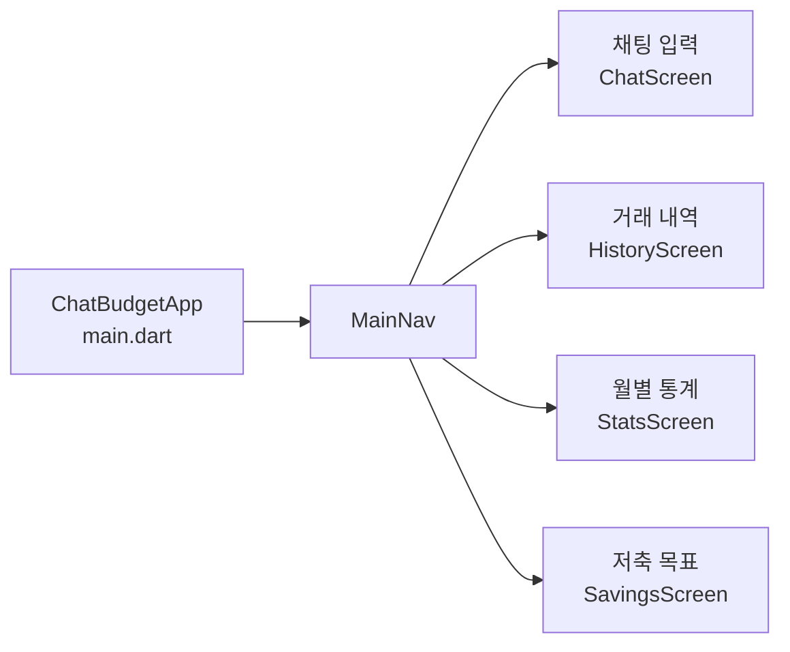
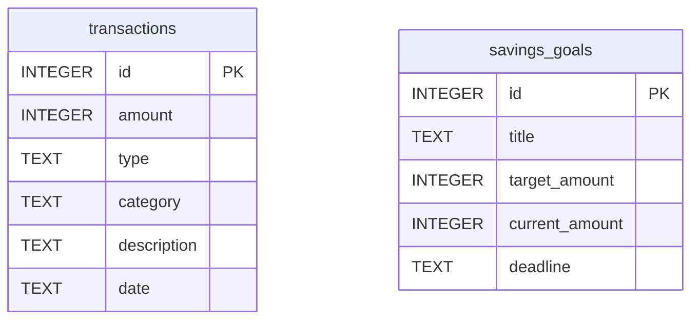

# 아키텍처 문서

## 앱 개요

ChatBudget은 채팅 인터페이스로 가계부를 기록하는 Flutter 앱입니다.  
서버 없이 로컬 SQLite에만 의존하며 오프라인에서 완전히 동작합니다.

---

## 레이어 구조

```
┌─────────────────────────────────────────┐
│           Presentation Layer            │
│  ChatScreen  HistoryScreen  StatsScreen │
│              SavingsScreen              │
├─────────────────────────────────────────┤
│            Domain Layer                 │
│  TransactionParser  (자연어 → 모델)       │
├─────────────────────────────────────────┤
│             Data Layer                  │
│  TransactionModel  SavingsGoalModel     │
│  DbHelper (SQLite CRUD)                 │
├─────────────────────────────────────────┤
│           Infrastructure                │
│  sqflite (SQLite)  chatbudget.db        │
└─────────────────────────────────────────┘
```

### Presentation Layer — `lib/features/`
화면 렌더링과 사용자 입력 처리. Flutter StatefulWidget 기반.  
상태 관리는 각 화면 내부의 `setState()` 로 처리 (단순 단일 화면 상태).

### Domain Layer — `lib/core/parser/`
비즈니스 로직 전담. UI에 의존하지 않는 순수 Dart 클래스.  
`TransactionParser.toTransaction(String)` — 자연어 문장 → `TransactionModel` 변환.

### Data Layer — `lib/core/models/` + `lib/core/database/`
데이터 모델 정의와 SQLite CRUD.  
`DbHelper` 는 싱글톤 패턴으로 앱 전체에서 하나의 DB 연결 공유.

---

## 전체 흐름 다이어그램



---

## 화면 구성 다이어그램



---

## DB 스키마



---

## 새 화면 추가하기

1. `lib/features/<기능명>/<기능명>_screen.dart` 파일 생성
2. `lib/main.dart` 의 `_screens` 리스트와 `NavigationBar destinations` 에 추가
3. DB 쿼리가 필요하면 `lib/core/database/db_helper.dart` 에 메서드 추가

---

## API 호출 위치

이 앱은 외부 API를 사용하지 않습니다 (오프라인 전용).  
DB 호출은 **Data Layer** (`DbHelper`) 에서만 발생하며,  
Presentation Layer 에서 `await DbHelper.instance.xxx()` 형태로 직접 호출합니다.

> 향후 서버 API 연동이 필요하다면 `lib/core/services/` 폴더를 신설하고  
> Presentation ↔ Service ↔ DB 3단계로 분리하는 것을 권장합니다.

---

## 기술 선택 요약

| 결정 | 선택 | 문서 |
|------|------|------|
| 모바일 프레임워크 | Flutter | [ADR-0001](../.planning/decisions/ADR-0001-mobile-framework.md) |
| 상태 관리 | StatefulWidget / setState | [ADR-0002](../.planning/decisions/ADR-0002-state-management.md) |
| 로컬 DB | sqflite (SQLite) | [ADR-0003](../.planning/decisions/ADR-0003-local-database.md) |
